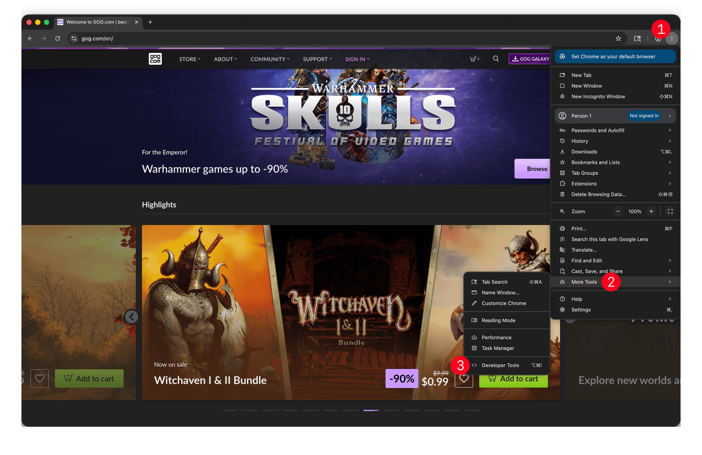
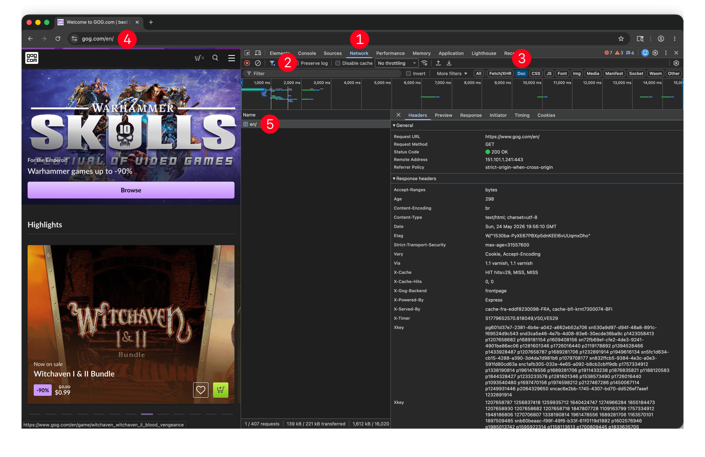
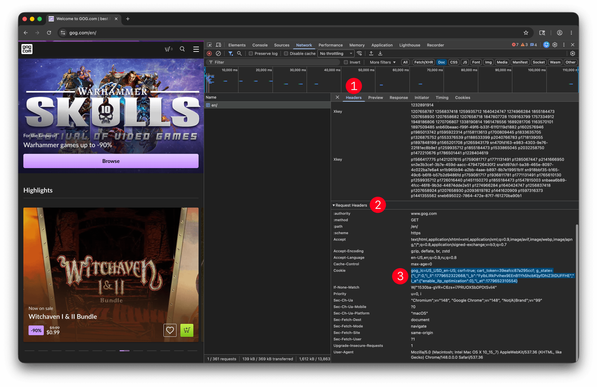

# coost

coost is a cookies storage module for reading, writing and importing cookie jars.

## Importing cookies from an existing browser session

Instructions below are presented for Google Chrome browser, would work similarly for any other browser. You don't need to install any extensions - the browser is all you need. 

To copy browser session cookies follow the 3 steps process:

### Step 1 - Open Developer Tools

1. Launch Google Chrome, then select `Customize and control Google Chrome` menu item, visually represented as three vertical dots
2. Select `More Tools` menu item
3. Select `Developer Tools`

### Step 2 - Select root document in the Network tab

1. Select `Network` tab in the Developer Tools
2. Click on the `Filter` tool
3. Select `Doc` filter
4. Navigate to the desired website, e.g. `https://www.gog.com`
5. Select the first (root) document request in the list and observe that details on the right side have data. If no data is present - repeat 4-5 until you see data similar to the image

### Step 3 - Copy Cookie Request header

1. Select `Headers` tab in the request details
2. Scroll to `Request Headers` (not `Response Headers`!)
3. Find `Cookie` header, select the value and copy it (see the example of selected value in the image above)

### Step 4 - Importing cookies in an app that uses coost

Refer to the application documentation on how to import that cookie value, e.g. `/import-cookies` page or `import-cookies` CLI command